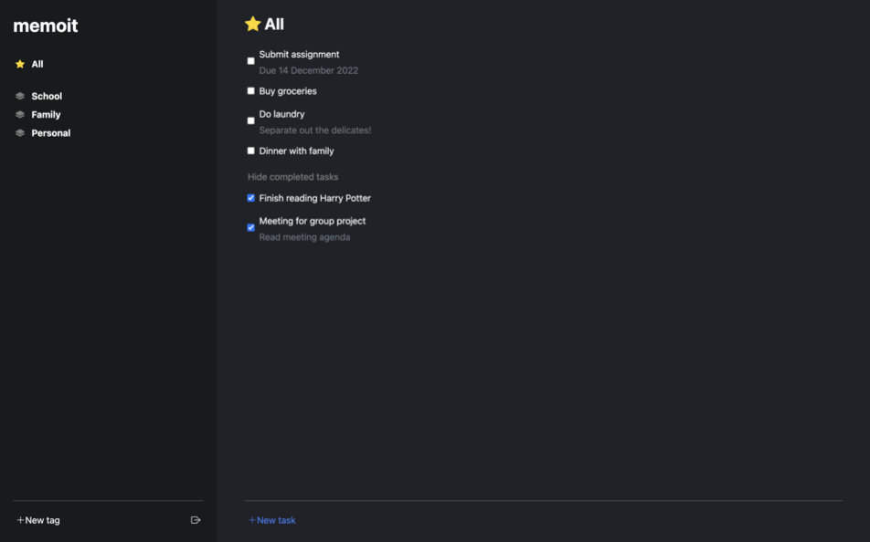
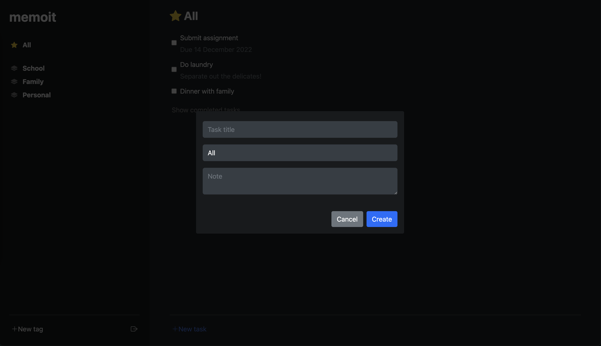

## **About memoit**

[**memoit**](https://memoit-production.herokuapp.com/){:target="_blank"} is a **to-do list manager** web application designed to help anyone looking to record their daily tasks. As a user, you can easily **create, edit, and delete tasks**. Using memoit's **tagging system**, you can categorize tasks under specific tags. Finally, you can view your to-do list on **any web browser** through memoit's secure user authentication feature and mobile-friendly design.

This user guide details how to use memoit on a daily basis. Get started now by heading over to the [Getting Started](#getting-started) section!

---

## **Table of Contents**
{:.no_toc}

- Table of Contents
{:toc}

---

## **Getting Started**

Visit memoit at [**https://memoit-production.herokuapp.com/**](https://memoit-production.herokuapp.com/){:target="_blank"}!

After you open memoit, the application will appear as a login page.

For first-time users, you can click on 'Register here' to create a new account for memoit as circled in the above image.

If you have an account, enter your account credentials to log in.

After logging into memoit, you will be brought to the dashboard where you can view all of your tasks.

Congratulations! You can now start using memoit.

---

## **Adding Tasks**

1. To add a new task, click on the 'New Task' button located at the bottom of the dashboard.
2. Enter the following task details into their respective fields:

   |             | Description                            | Required?              |
   | ----------- | -------------------------------------- | ---------------------- |
   | Name        | Name of the task                       | Yes                    |
   | Tag         | Tag that the task is categorized under | Yes. 'All' by default. |
   | Description | Description of the task                | No                     |

   

3. Click on 'Create' to create the task. The task is now shown in the to-do list.

---

## **Marking Tasks as Completed**

1. To mark a task as completed, click on the empty checkbox located on the left of the task.
2. To view completed tasks, click on 'Show completed tasks'.
3. To mark a task as incomplete, click on the ticked checkbox.

---

## **Editing Tasks**

1. To edit the name, tag, or description of a task, hover your cursor over the task.
2. Click on the 'Edit Task' icon as circled in the image below.
   

3. You can now edit the details of task.
   

4. Click on 'Update' to update the task. The task is now be updated in the to-do list.

---

## **Deleting Tasks**

1. To delete a task, hover your cursor over the task.
2. Click on the 'Delete Task' icon as circled in the image below.
   

3. The task is now deleted from the to-do list.

---

## **Adding Tags**

1. To add a new tag, click on 'New tag' located at the bottom of the left sidebar.
2. Enter the name of the tag and click on the 'Create' icon.
3. The new tag is now shown in the left sidebar.

---

## **Deleting Tags**

1. To delete a tag, hover your cursor over the tag.
2. Click on the 'Delete Tag' icon as circled in the image below.
   

3. Note that **all tasks under this tag** will be deleted as well.
4. Confirm your deletion by clicking 'OK' in the confirmation prompt.
5. The tag and its associated tasks are now deleted from the to-do list.

---

## **Exiting memoit**

1. To log out of memoit, click on the 'Log out' icon located at the bottom of the left sidebar.
